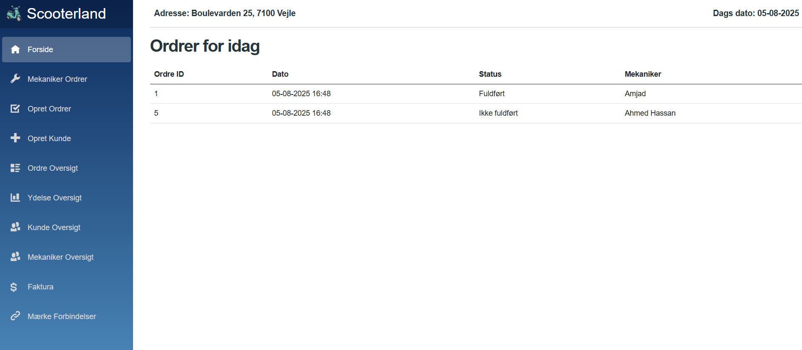
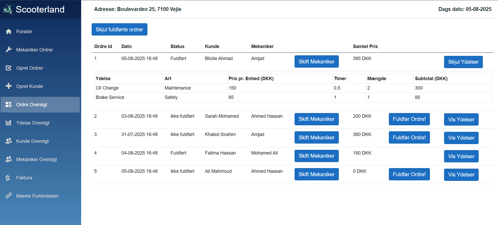
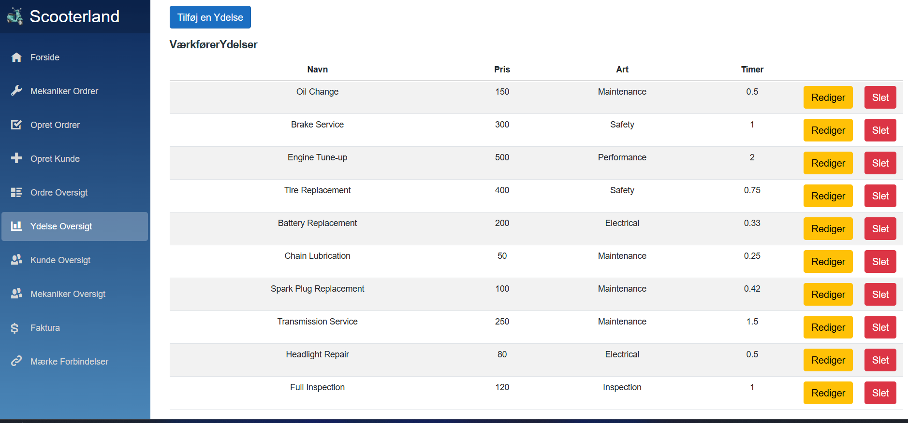

# ScooterLand - Workshop Management System

A comprehensive workshop management system built with **Blazor WebAssembly** and **ASP.NET Core** for managing scooter repair and maintenance services.

## 🚀 Features

- **Customer Management** - Add, edit, and track customer information
- **Work Orders** - Create and manage repair orders with services
- **Invoice Generation** - Automatic invoicing from completed orders
- **Mechanic Management** - Assign and track mechanic specializations
- **Service Catalog** - Define services with pricing and time estimates
- **Brand Management** - Manage scooter brands and assignments

## 🏗️ Tech Stack

- **Frontend**: Blazor WebAssembly, Radzen Components
- **Backend**: ASP.NET Core 8.0 Web API
- **Database**: SQL Server with Entity Framework Core
- **UI**: Bootstrap, Responsive Design

## 🚀 Quick Start

### Prerequisites
- .NET 8.0 SDK
- SQL Server LocalDB
- Visual Studio 2022 or VS Code

### Setup
```bash
# Clone repository
git clone https://github.com/AmjadRenno/ScooterLand.git
cd ScooterLand

# Setup database
cd Server
dotnet ef database update

# Run application
dotnet run
```

Navigate to: `https://localhost:7081`

## 🎬 Demo

[](https://youtube.com/watch?v=YOUR_VIDEO_ID)

## 📸 Screenshots

### Dashboard


### Order Management


### Invoice Generation


## 🗂️ Project Structure

```
ScooterLand/
├── Client/          # Blazor WebAssembly Frontend
├── Server/          # ASP.NET Core Web API
├── Shared/          # Shared Models
└── Tests/           # Unit Tests
```

## 🔧 Database Schema

**Main Entities**: Customer, Mechanic, Order, Service, Invoice, Brand
- Full CRUD operations for all entities
- Many-to-many relationships between orders and services
- Automatic invoice generation from completed orders

## 💡 Key Technical Features

- **Repository Pattern** with Dependency Injection
- **Entity Framework Core** with Code-First migrations
- **RESTful API** design with proper HTTP status codes
- **Responsive UI** with Radzen Blazor components
- **CORS** configured for development

## 🚨 Troubleshooting

**Database Issues**: Run `dotnet ef database update` in Server folder
**CORS Issues**: Clear browser cache or try incognito mode
**Build Errors**: Ensure .NET 8.0 SDK is installed

## 👨‍💻 Development Team

Developed by **Amjad Renno** and team members as a collaborative university group project at UCL during 2nd semester.

## 🎯 Skills Demonstrated

**Frontend**: Blazor WebAssembly, Component-based architecture, State management
**Backend**: ASP.NET Core, Entity Framework, Repository pattern, Dependency injection
**Database**: SQL Server, Relational design, Migrations
**Tools**: Git, Visual Studio, Agile development

---

**Ready to manage your scooter workshop efficiently! 🛵✨**
